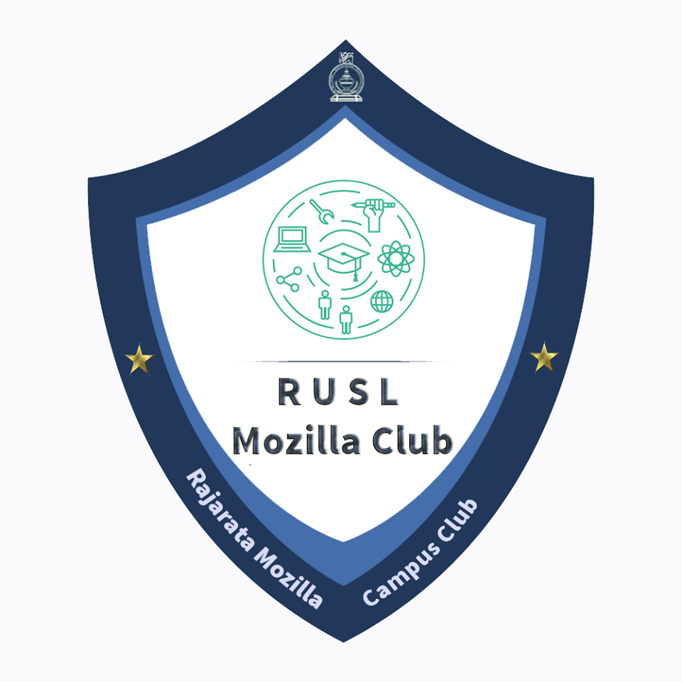

# [Offcial Homepage: Mozilla Campus Club - RUSL](https://fazeelanizam13.github.io/mozilla-rusl/)

This website was developed as an entry for the hackathon conducted by Mozilla Campus Club of Rajarata University of Sri Lanka to select one that would subsequently be given the opportunity to represent the club.

## On the Design Choices:

### Color Palette

The colors used in the design are based on the official logo of Mozilla Campus Club - RUSL. 

The base color is a dark and warm-toned blue, while a medium turquoise was used as the accent. 
Negative spaces were left white to keep the design minimalistic and clean, and for the font, a dark grey which seemed to complement the base blue was chosen. 
A light grey was used in the above-the-fold area to highlight the welcome quote and the CTA button, with an opacity level below 0.5.

### Font

A simple, legible, sans-serif font was the goal, and [Assistant](https://github.com/hafontia/Assistant) was the first choice. 
Assistant is a Hebrew and Latin type family with a contemporary sans serif Hebrew design by [Ben Nathan.](https://github.com/hafontia) Out of the 6 styles that the family contains, this design makes use of the Regular, Semi-Bold and Bold styles.

### Micro-interactions and Animations

A mix of both JQuery and CSS keyframes were used to animate elements, to make the user experience better as well as to ease use, for an example, to make it obvious that certain cards are actually clickable links rather than mere visual elements.

Navigation is hidden on smaller screens with several goals, mainly, conserving space (a fixed menu that is big enough to be tap-able can rob away some of the already scarce space on a mobile) and making the site appear more native app like. In this case, navigation is accessible after clicking a 'hamburger' menu-button.  
Meanwhile it is left as a fixed bar on wider viewports for faster access. Its background appears transparent until the user scrolls past above-the-fold area, when it turns into the base blue with an opacity of 0.7.

Some elements, including section headings are animated in appropiate ways when they enter the viewport for the first time, to draw attention.

Once again to save space in both mobile and desktop by avoiding content overload in the 'Gallery' section, the following strategy was used: the user is given the option to select the specific campus event that they want to view pictures of, each as an image carousel.

While carousels allow multiple pieces of content to occupy the same specific amount of space, here, several carousels are integrated into said space, each of which can be viewed optionally. 
When an event name is cliked on, the respective set of images comes into view and that of the previous selection goes out of view, and this transition is visible due to the carousel dimension change when this happens.  
How I achieved that effect, I truly don't know, because it happened by accident.

### Built With

* HTML5
* CSS3
* JavaScript, [JQuery](https://jquery.com)

## Authors

* **Fazeela Nizam** @[fazeelanizam13](https://github.com/fazeelanizam13)
